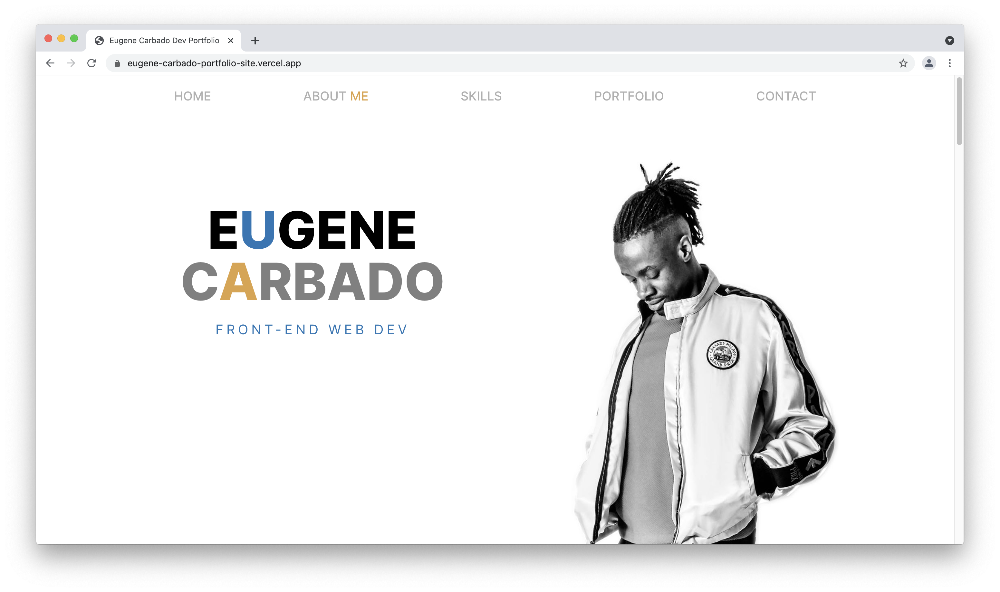
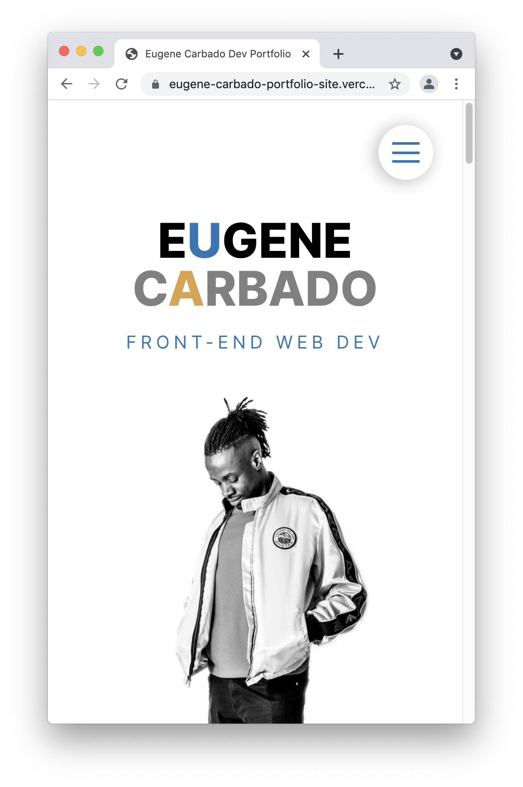

# Eugene Carbado portfolio site

This is my portfolio site that I built using html, scss, javascript and webpack as a build tool. 

## Table of contents

- [Overview](#overview)
  - [Screenshot](#screenshot)
  - [Links](#links)
- [My process](#my-process)
  - [Built with](#built-with)
- [Author](#author)

## Overview

I wanted a simple yet elegant design for my site, something that would make me stand out as a developer by showcasing my skills.

### Screenshot

### Links

- Live Site URL: [Live site for my solution URL](https://eugene-carbado-portfolio-site.vercel.app/)

## My process

For my process I used SCSS and HTML purley to demonstrate my skills with flexbox. I used Javascript for the nav menu when the website is viewed on mobile. I also used wepback to bundle my code. I used a moble first workflow then added the media queries for tablet and desktop.

### Built with

- Semantic HTML5 markup
- SCSS custom properties
- Flexbox
- Mobile-first workflow
- Javascript
- Webpack for bundling

## Author

- Website - [Eugene Carbado](https://github.com/EugeneCarbado)
- Twitter - [@CarbadoTheDev](https://www.twitter.com/CarbadoTheDev)
