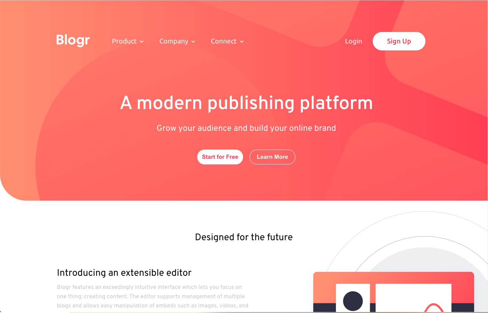

# Frontend Mentor - Blogr landing page solution

This is a solution to the [Blogr landing page challenge on Frontend Mentor](https://www.frontendmentor.io/challenges/blogr-landing-page-EX2RLAApP). Frontend Mentor challenges help you improve your coding skills by building realistic projects. 

## Table of contents

- [Overview](#overview)
  - [The challenge](#the-challenge)
  - [Screenshot](#screenshot)
  - [Links](#links)
- [My process](#my-process)
  - [Built with](#built-with)
  - [What I learned](#what-i-learned)
  - [Continued development](#continued-development)
  - [Useful resources](#useful-resources)
- [Author](#author)

## Overview

### The challenge

Users should be able to:

- View the optimal layout for the site depending on their device's screen size
- See hover states for all interactive elements on the page

### Screenshot

### Links

- Solution URL: [Solution URL](https://www.frontendmentor.io/solutions/typemasterprelaunchlandingpage-SX5JzJU90)
- Live Site URL: [Live site for my solution URL](https://blogr-landing-page-beta.vercel.app/)

## My process

For my process I used SCSS and HTML purley to demonstrate my skills with flexbox and
SVG's. I used Javascript for the nav menu when the website is viewed on mobile. I also used wepback to bundle my code. I used a moble first workflow then added the media qieries for tablet and desktop.

### Built with

- Semantic HTML5 markup
- CSS custom properties
- SVG's
- Flexbox
- Mobile-first workflow
- Javascript
- Webpack for bundling

### What I learned

I learnt a lot of about using svg's in a project in terms of resizing. Also how they can cause problems with pushing elements out if being reszied as the z-index was not working. I could apply better properties to achieve my desired results but am satified that I was able to use them. I also had some more exposure to flexbox which I feel very comfoortable using. I did not use any grid but feel I could have to really maximise the result I was going for. Using SCSS also I felt I understood more what it was doing and how I can use easier syntax in terms of mixin's. 

### Continued development

I want to further develop my skills with SCSS in terms of grid as I feel they will really benefit me going forward in my career.

### Useful resources

- [css-tricks.com guide to scale svg's](https://css-tricks.com/scale-svg/#:~:text=Any%20height%20or%20width%20you,default%20height%20for%20inline%20SVG.) - This helped me to understand how to resize SVG's.

## Author

- Website - [Eugene Carbado](https://github.com/EugeneCarbado)
- Frontend Mentor - [@mrgenie83](https://www.frontendmentor.io/profile/mrgenie83)
- Twitter - [@CarbadoTheDev](https://www.twitter.com/CarbadoTheDev)
